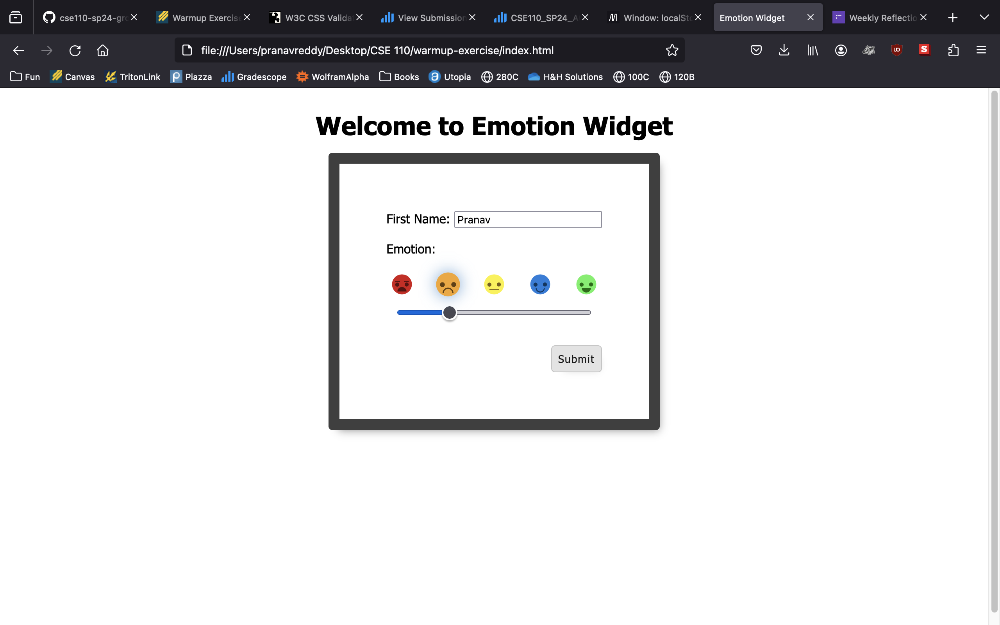
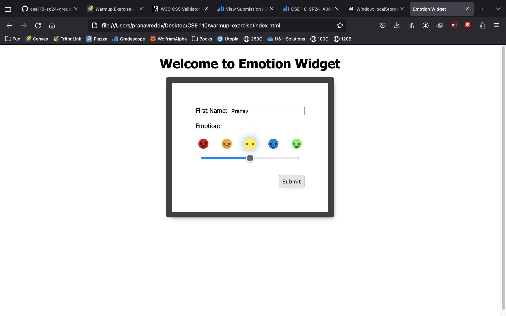
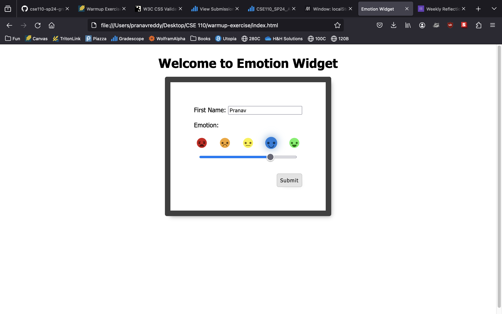
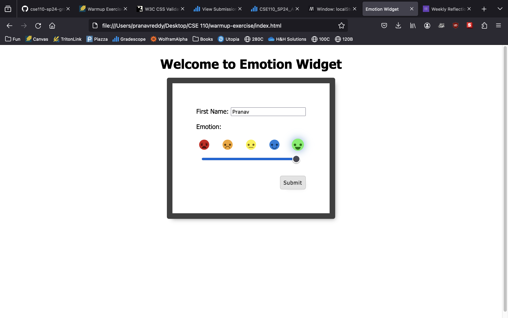
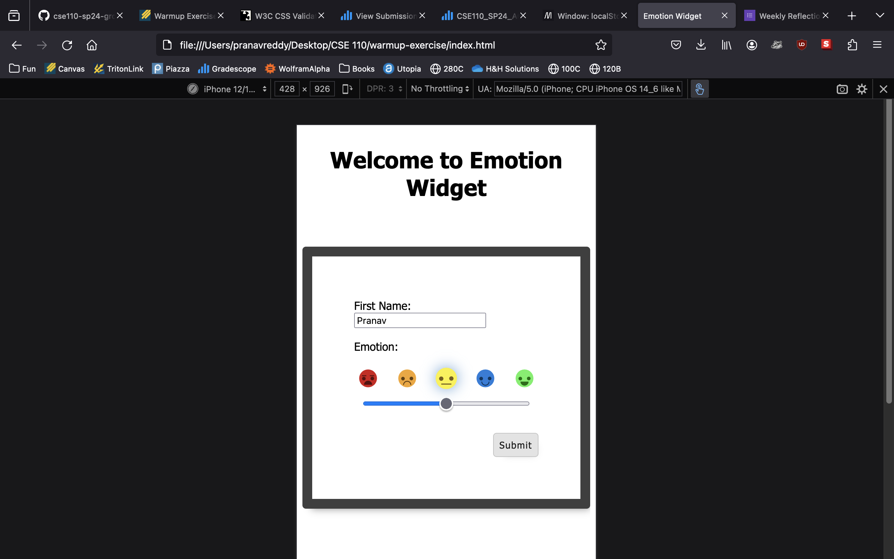
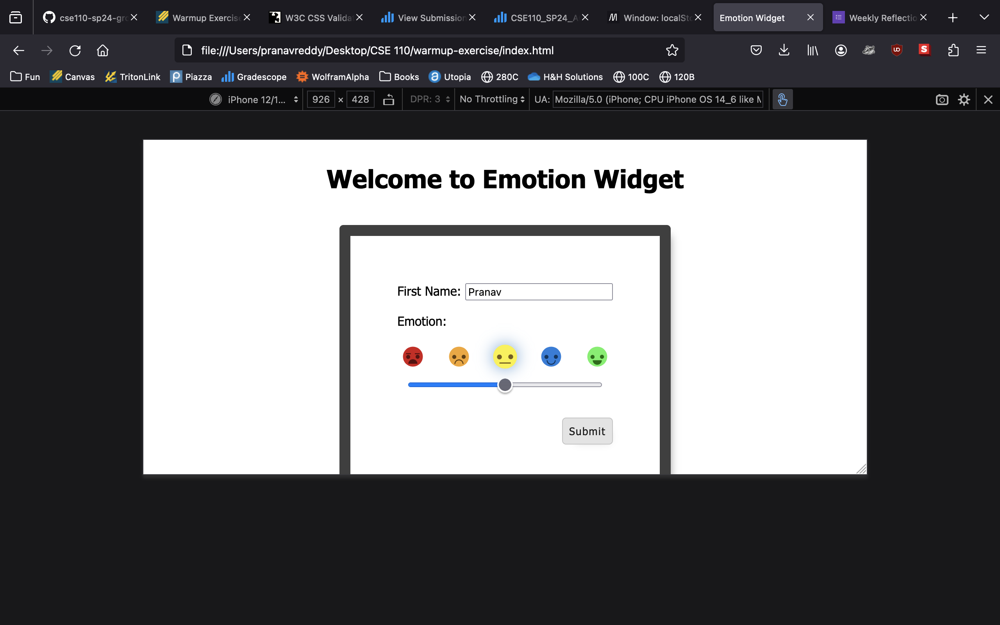
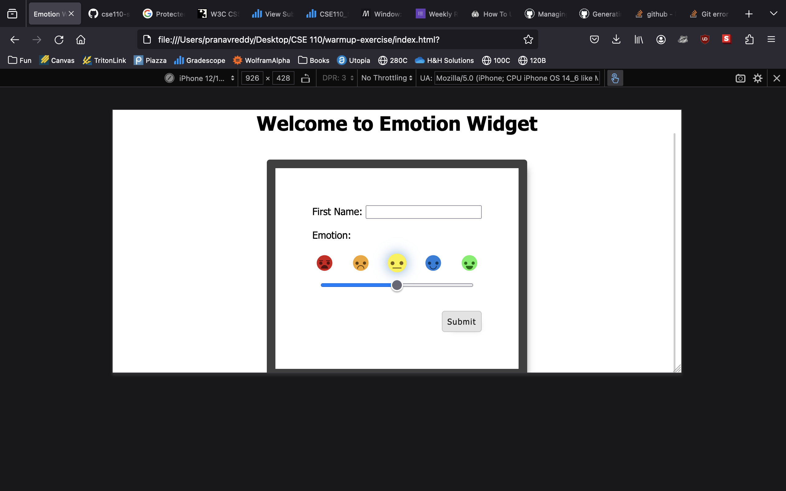
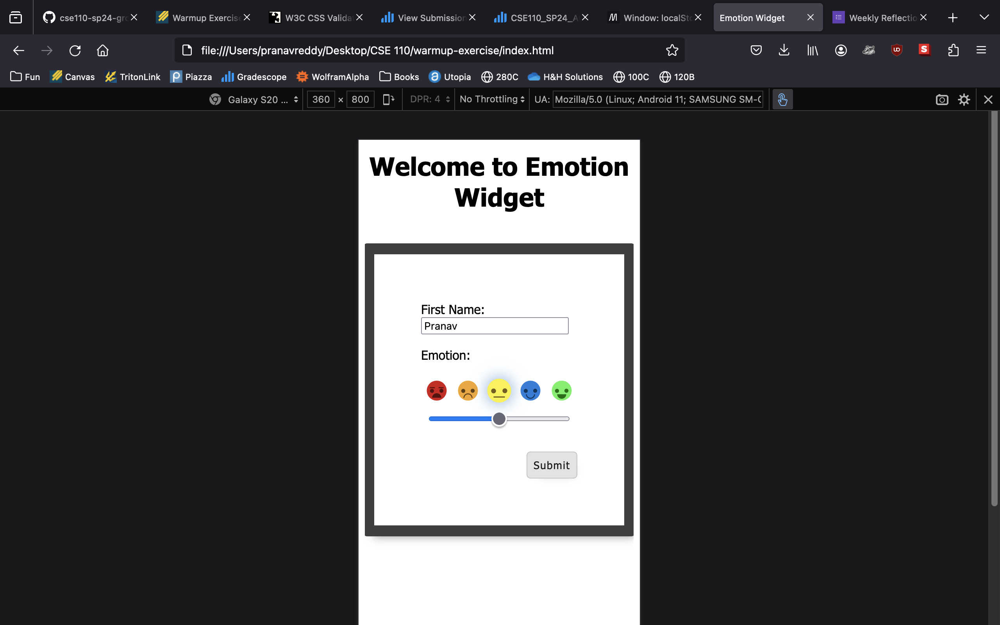
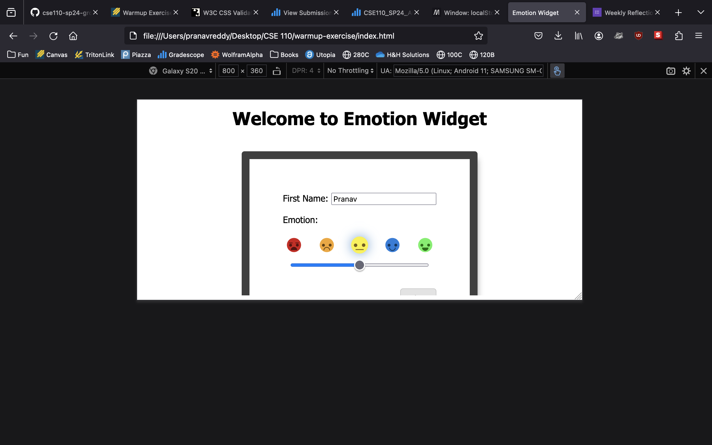
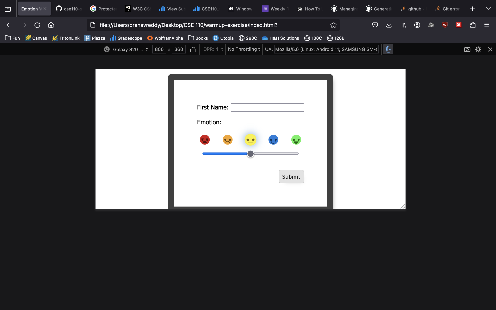

# Testing
## Functionality
### Desired Behavior
1. Users must be able to see 5 emotions in a row.
2. Users must be able to see a submit button below the slider.
3. Users must be able to move the slider left and right.
4. Users must be able to see the currently selected emotion glow in response.
5. Users must be able to enter a name into a text box above the emotion slider.
6. Users must be able to press submit after entering a name.
7. Users should not be able to enter an empty name.
8. The submit button should respond when pressed.
9. The site should flow with mobile layouts.

## Emotion Functionality
This test was done on Mozila Firefox 124.0.2 on a 2020 Macbook Pro.
The emotion sliders function as intended, seen here

The response after pressing submit has not been implemented yet, so we can say that point 8 is not achieved.

On the mobile simulator using Firefox's DevTools, the slider is not usable.
It responds to tapping the desired position, but does not slide.

## Mobile Responsiveness
I used the DevTools in Firefox to test alternate mobile layouts.

### iPhone 14
The vertical layout appears fine, as seen here

However, the horizontal layout appears fine as well, seen here

**This has now been fixed, thank you Rei!**

### Galaxy 20
The vertical layout appears fine, as seen here

However, the horizontal layout cuts off the submit button.
This is undesired behavior because it violates point 2 in the desired behavior.

**This has now been fixed, thank you Rei!**

## Summary
- [x] Users must be able to see 5 emotions in a row.
- [ ] Users must be able to see a submit button below the slider.
    - Does not work on horizontal mobile layouts.
- [x]  Users must be able to move the slider left and right.
- [x]  Users must be able to see the currently selected emotion glow in response.
- [x]  Users must be able to enter a name into a text box above the emotion slider.
- [ ]  Users must be able to press submit after entering a name.
    - The partially viewable submit button is still clickable, but users may not notice or know its purpose.
- [ ]  Users should not be able to enter an empty name.
- [ ]  The submit button should respond when pressed.
- [ ]  The site should flow with mobile layouts.